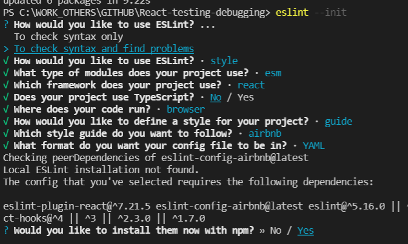

## Debugging tools

1. Browser Dev tools - comes with all browsers (ctrl + shift + I)

2. React developer tools  - (chrome extensions, firefox add-ons) or
    React developer tools standalone (https://www.npmjs.com/package/react-devtools)	
	Adds components & profiler tab to the  dev tools	

3. JEST - comes with the create-react-app

4. Flow  - for Javascript static type checker (https://flow.org/) 
 
    >     npm i flow-bin --save-dev

    >     npm run flow init

5. Install VS Code eslint extension 

6. Install eslint npm package globally

    >     npm i -g eslint 

    >     eslint --init

    

7. Simple testing using test and expect (https://jestjs.io/docs/expect)

8. Snapshot testing with Jest 

    >   npm i react-test-renderer

9. Organize the code with describe()

10. Code coverage test with Jest

    >   "coverage" : "npm run test -- --coverage --watchAll=false"

11. Eslint - Place the cursor at problem place and press ctrl + .

12. Fixing the Static type check issue with Flow Js
    
    Add the following code to top line of the js files
    >   // @flow

    Add the following line to the package.json in the script session
    >   "flow": "flow" 

    Run flow test in the terminal
    >   npm run flow 

